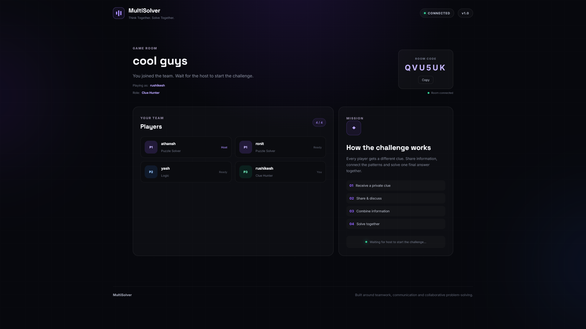
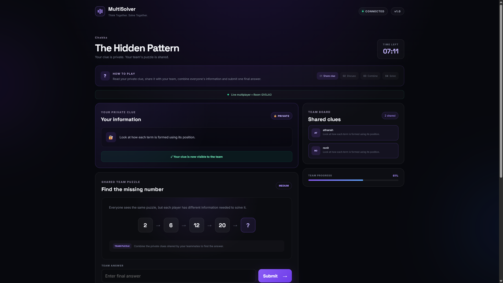
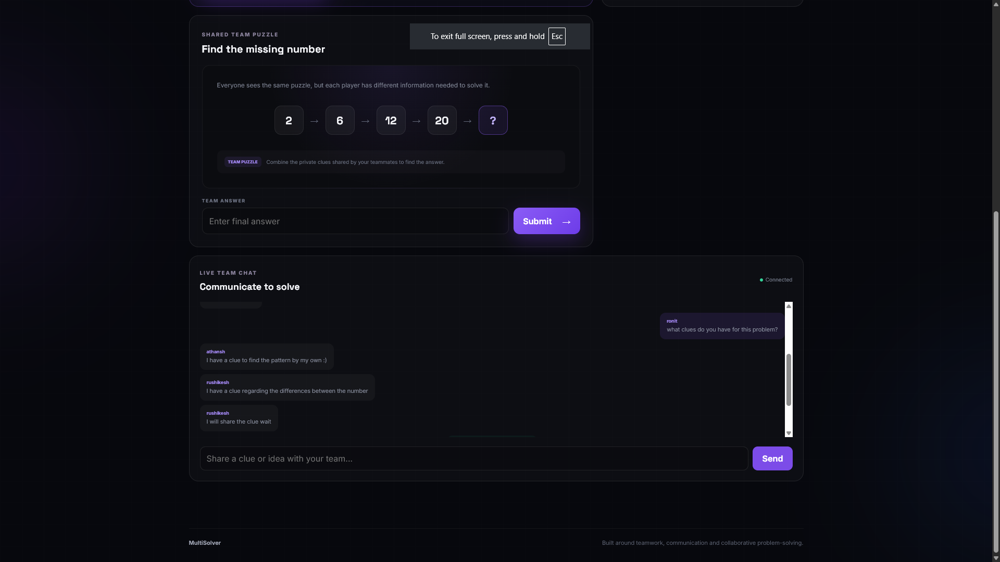
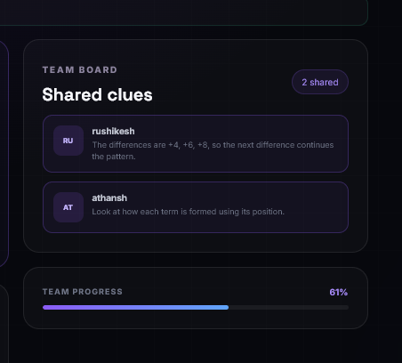

# MultiSolver

> **A real-time multiplayer problem-solving game where players work together, communicate, share clues, and solve puzzles as a team.**

MultiSolver is a multiplayer cooperative puzzle game built around **teamwork and communication**.

Players join the same room, receive roles, communicate through real-time chat, share clues, and collaboratively solve a puzzle. The application uses **WebSockets** to keep the game state synchronized between all connected players.

---

## Features

*  **Multiplayer Rooms**

  * Players can join a shared room.
  * Each room supports up to 4 players.

*  **Room Management**

  * Automatic host assignment.
  * Room information and player state are synchronized in real time.
  * Host is reassigned when the current host disconnects.

*  **Player Roles**

  * Players can be assigned different roles.
  * Role information is synchronized across the room.

*  **Real-Time Chat**

  * Players can communicate with their teammates during the game.

*  **Clue Sharing**

  * Players can share clues with the rest of their team.

*  **Collaborative Puzzle Solving**

  * Players work together to determine the answer.
  * Answers are checked by the backend and the result is broadcast to everyone.

*  **Real-Time Game Synchronization**

  * Game start events, player changes, messages, clues, and answers are synchronized through WebSockets.

*  **Connection Handling**

  * Players joining and leaving rooms are handled dynamically.
  * Disconnects trigger updates for the remaining players.

---

#  Screenshots

## Room / Lobby

Players can join a room and see the other connected players before starting the game.



---

## Multiplayer Game

The game interface allows players to collaborate while solving the puzzle.



---

## Team Chat

Players can communicate with each other using the real-time chat system.



---

## Clue Sharing

Players can share clues with their teammates to help solve the puzzle.



---

#  Architecture

The application consists of two main parts:

```text
                    ┌──────────────────────┐
                    │       Frontend       │
                    │   React Application  │
                    └──────────┬───────────┘
                               │
                         WebSocket
                               │
                               ▼
                    ┌──────────────────────┐
                    │       Backend        │
                    │       FastAPI        │
                    └──────────┬───────────┘
                               │
                               ▼
                    ┌──────────────────────┐
                    │  Connection Manager  │
                    │                      │
                    │ Rooms / Players      │
                    │ Game State           │
                    │ Broadcasting         │
                    └──────────────────────┘
```

The frontend communicates with the FastAPI backend using a persistent WebSocket connection.

This allows events such as:

```text
Player joins
     ↓
Backend updates room
     ↓
Broadcast to all players
     ↓
All frontends update
```

---

#  Tech Stack

### Frontend

* React
* JavaScript
* WebSocket API
* Vite

### Backend

* Python
* FastAPI
* WebSockets

### Communication

* WebSocket
* JSON messages

---

#  Project Structure

The current project is organized into frontend and backend components:

```text
multisolver/
│
├── frontend/
│   └── public/
|       ...
|   └── src/
|       ├── App.css
|       ├── App.jsx
|       ├── index.css
|       ├── main.jsx
|    ...
│
├── server/
│   └── app/
│       ├── main.py
│       └── websocket/
│           ├── manager.py
│           ├── connection.py
│           ├── handlers.py
│           └── messages.py
│
└── README.md
```

> The prototype currently contains some of the game/WebSocket logic together in the backend. The structure above represents the intended modular organization as the project continues to evolve.

---

#  How Multiplayer Communication Works

Each player connects to a room using a WebSocket:

```text
/ws/{room_id}
```

The backend maintains the connections and room state.

For example, when a player joins:

```text
Player A
   │
   │ join
   ▼
FastAPI WebSocket
   │
   ▼
ConnectionManager
   │
   ├── Update room
   ├── Register player
   └── Broadcast join event
          │
          ├──────────► Player B
          ├──────────► Player C
          └──────────► Player D
```

This keeps the game state synchronized between players.

#  Running the Project Locally

## 1. Clone the repository

```bash
git clone https://github.com/Detective-123/multisolver.git

cd multisolver
```

---

## 2. Start the Backend

Navigate to the server directory:

```bash
cd server
```

Create and activate a virtual environment:

### Windows

```bash
python -m venv venv
venv\Scripts\activate
```

### Linux / macOS

```bash
python3 -m venv venv
source venv/bin/activate
```

Install dependencies:

```bash
pip install -r requirements.txt
pip install uvicorn[standard]
```

Start the FastAPI server:

```bash
uvicorn app.main:app --reload
```

The backend should now be available at:

```text
http://localhost:8000
```

---

#  Start the Frontend

Open another terminal and navigate to the frontend:

```bash
cd frontend
```

Install dependencies:

```bash
npm install
```

Start the development server:

```bash
npm run dev
```

The frontend will normally be available at:

```text
http://localhost:5173
```

---

#  Testing Multiplayer

To test the multiplayer functionality:

1. Start the backend.
2. Start the frontend.
3. Open the application in multiple browser tabs/windows.
4. Join the same room from each client.
5. Observe the synchronized player list.
6. Start the game from the host.
7. Test chat and clue sharing.
8. Submit the puzzle answer.
9. Disconnect a player and observe the event being logged in the team chat.

---

#  Current Game Flow

```text
                    Create / Join Room
                           │
                           ▼
                    ┌─────────────┐
                    │  Multiplayer │
                    │    Lobby     │
                    └──────┬──────┘
                           │
                           ▼
                    Players Connect
                           │
                           ▼
                     Roles Assigned
                           │
                           ▼
                       Host Starts
                           │
                           ▼
                    ┌─────────────┐
                    │    Puzzle   │
                    └──────┬──────┘
                           │
              ┌────────────┼────────────┐
              ▼            ▼            ▼
           Chat        Share Clues   Discuss
              │            │            │
              └────────────┼────────────┘
                           ▼
                     Submit Answer
                           │
                           ▼
                    Check Solution
                           │
                    ┌──────┴──────┐
                    ▼             ▼
                 Incorrect      Correct
                                  │
                                  ▼
                             Team Solved
```

---

#  Future Improvements

The current version is a prototype. Planned improvements include:

*  More puzzle types
*  Randomized puzzles
*  Scoring system
*  Timed challenges
*  Leaderboards
*  More sophisticated player roles
*  Better room security
*  Persistent game/session storage
*  Further backend modularization
*  Automated backend and WebSocket tests
*  Deployment for public multiplayer sessions

---

#  Project Goal

The goal of MultiSolver is to explore how **real-time multiplayer systems** can be combined with **problem-solving mechanics**.

Rather than simply solving a puzzle individually, the game encourages players to:

* communicate,
* divide responsibilities,
* exchange information,
* reason together,
* and reach a solution as a team.

---

#  Development

This project is being developed incrementally as a multiplayer systems prototype.

The main technical focus areas are:

* WebSocket communication
* Room management
* Connection management
* Real-time state synchronization
* Multiplayer event handling
* Collaborative game mechanics

---
